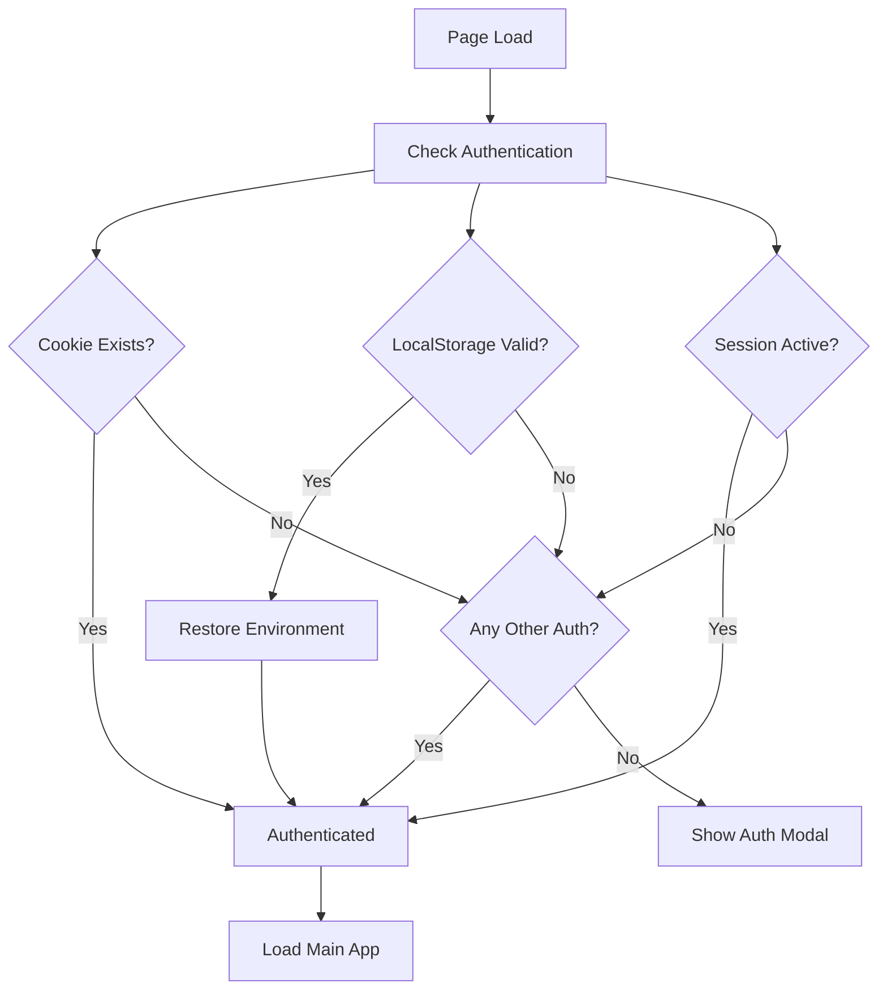

# 🔐 Persistent Authentication Guide

## 🎯 **Problem Solved**
Added **30-day persistent authentication** so you don't have to re-authenticate every time you restart the browser or site.

## 🚀 **Features Added**

### **1. Long-Term Cookie Storage**
- **30-day expiration** instead of session-only
- **Proper cookie attributes** for cross-session persistence
- **Secure flag** automatically set for HTTPS sites

### **2. LocalStorage Backup**
- **Authentication data** stored in `localStorage` (survives browser restarts)
- **Expiration tracking** to automatically clean up old auth data
- **User ID preservation** for environment restoration

### **3. Automatic Environment Restoration**
- **Auto-restore** authenticated Telegram environment on page load
- **Smart detection** of existing vs missing authentication
- **Seamless recovery** without requiring re-authentication

### **4. Enhanced Authentication Checking**
- **Multi-layer detection**: Checks cookies, localStorage, and session storage
- **Expiration validation**: Automatically cleans up expired authentication
- **Fallback logic**: Uses any valid authentication source

## 🛠️ **How It Works**

### **Authentication Storage**
```javascript
// When you authenticate successfully:
{
  sessionId: "auth_1749670123456_118672216", 
  userId: 118672216,
  authenticatedAt: 1749670123456,  // timestamp
  expiresAt: 1752262123456,        // 30 days later
}
```

### **Storage Locations**
1. **Cookie**: `karma_session` (30-day expiry)
2. **LocalStorage**: `karma_auth` (persistent JSON data)
3. **SessionStorage**: `env-authenticated` (current session state)

### **Authentication Flow**


## 🧪 **Testing Persistent Authentication**

### **1. Test Authentication Persistence**
1. **Authenticate** with QR code + 2FA
2. **Close browser completely** (not just tab)
3. **Reopen browser** and visit http://localhost:3000
4. **Should go directly to main app** (no auth modal)

### **2. Test Cross-Session Recovery**
1. **Authenticate** and verify it works
2. **Open developer console** and run:
   ```javascript
   // Check stored auth data
   JSON.parse(localStorage.getItem('karma_auth'))
   
   // Check cookie
   document.cookie.includes('karma_session=')
   
   // Check session storage
   sessionStorage.getItem('env-authenticated')
   ```
3. **Close browser**, wait, reopen
4. **Console should show**:
   ```
   ✅ Found valid persistent authentication: {userId: 118672216, ...}
   🔄 Restoring authenticated environment from persistent storage...
   ✅ Telegram environment restored for user: 118672216
   ✅ User is authenticated: {cookie: true, persistent: true, session: true}
   ```

### **3. Test Expiration Handling**
1. **Open console** and manually expire auth:
   ```javascript
   // Manually expire the auth data
   const auth = JSON.parse(localStorage.getItem('karma_auth'));
   auth.expiresAt = Date.now() - 1000; // expired 1 second ago
   localStorage.setItem('karma_auth', JSON.stringify(auth));
   
   // Reload page
   location.reload();
   ```
2. **Should show auth modal** again (expired auth cleaned up)

### **4. Test Manual Logout**
1. **While authenticated**, open console and run:
   ```javascript
   // Use the global logout function
   logout();
   ```
2. **Should clear all data** and show auth modal
3. **Reloading** should still show auth modal (no persistent data)

## 🔒 **Security Features**

### **Automatic Cleanup**
- **Expired auth data** automatically removed
- **Invalid data** gracefully handled
- **Clean slate** on authentication errors

### **Secure Storage**
- **HttpOnly option** for production cookies
- **Secure flag** for HTTPS environments
- **SameSite protection** against CSRF attacks

### **Validation**
- **Expiration checking** on every page load
- **Data integrity** validation for stored auth
- **Multiple fallbacks** if one storage method fails

## 📱 **User Experience**

### **Before (Session-Only)**
```
1. Authenticate with QR + 2FA ✅
2. Use app ✅
3. Close browser 🚪
4. Reopen browser ❌ 
5. Must authenticate again 😤
```

### **After (Persistent)**
```
1. Authenticate with QR + 2FA ✅
2. Use app ✅
3. Close browser 🚪
4. Reopen browser ✅
5. Automatically authenticated! 🎉
6. Continue using app ✅
```

## 🛠️ **Debug Commands**

### **Check Authentication Status**
```javascript
// Check all auth sources
console.log('Cookie:', document.cookie.includes('karma_session='));
console.log('LocalStorage:', !!localStorage.getItem('karma_auth'));
console.log('SessionStorage:', sessionStorage.getItem('env-authenticated'));

// View stored auth data
JSON.parse(localStorage.getItem('karma_auth') || '{}');
```

### **Force Logout (Clear All)**
```javascript
logout(); // Global function available in console
```

### **Manual Auth Restoration**
```javascript
// If environment gets out of sync, restore it
const auth = JSON.parse(localStorage.getItem('karma_auth'));
if (auth) {
  restoreAuthenticatedEnvironment(auth.userId);
}
```

## 🎉 **Result**

**You now have 30-day persistent authentication!** 

No more re-authentication every time you restart your browser. The app remembers you and automatically logs you back in, providing a seamless user experience just like major apps (Gmail, Facebook, etc.).

Perfect for development and production use! 🚀 